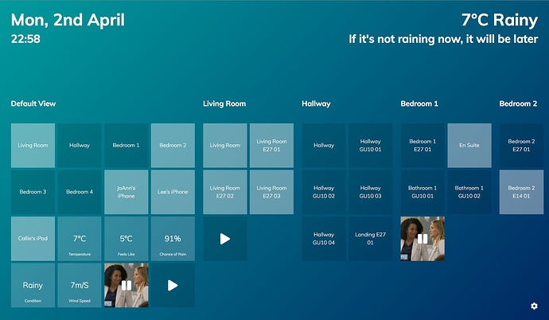

# Community Hass.io Add-ons: Home Assistant Control Panel

[![GitHub Release][releases-shield]][releases]
![Project Stage][project-stage-shield]
[![License][license-shield]](LICENSE.md)

[![GitLab CI][gitlabci-shield]][gitlabci]
![Project Maintenance][maintenance-shield]
[![GitHub Activity][commits-shield]][commits]

[![Bountysource][bountysource-shield]][bountysource]
[![Discord][discord-shield]][discord]
[![Community Forum][forum-shield]][forum]

[![Buy me a coffee][buymeacoffee-shield]][buymeacoffee]

Simple to use control panel for the ultimate home automation setup.



## Deprecation warning

**This add-on is in a deprecated state!**

This add-on is no longer supported or maintained.

You can still install this control panel manually or use the hosted version
offered by the author. For more information see:

<https://reformedreality.com/home-assistant-control-panel>

## About

Using a phone or tablet device, you can hook into your Home Assistant server
and get access to a simple to use Control Panel. Mount the device on your
wall to create the ultimate home automation accessory and unlock the true
potential of your Smart devices.

## Installation

The installation of this add-on is pretty straightforward and not different in
comparison to installing any other Hass.io add-on.

1. [Add our Hass.io add-ons repository][repository] to your Hass.io instance.
1. Install the "Home Assistant Control Panel" add-on
1. Start the "Home Assistant Control Panel" add-on
1. Check the logs of the "Home Assistant Control Panel" if it is error-free
1. Ensure you Home Assistant installation has set an API password.
1. Allow CORS access to your Home Assistant installation from this add-on.

The last 2 requirements/steps would need changes to your Home
Assistant `configuration.yaml` file:

```yaml
http:
  api_password: YOUR_PASSWORD
  cors_allowed_origins:
    - http://addres.to.your.hass.io:7080
```

In case you updated your `configuration.yaml` file, be sure to restart Home
Assistant to apply these changes.

**NOTE**: Do not add this repository to Hass.io, please use:
`https://github.com/hassio-addons/repository`.

## Docker status

[![Docker Architecture][armhf-arch-shield]][armhf-dockerhub]
[![Docker Version][armhf-version-shield]][armhf-microbadger]
[![Docker Layers][armhf-layers-shield]][armhf-microbadger]
[![Docker Pulls][armhf-pulls-shield]][armhf-dockerhub]
[![Anchore Image Overview][armhf-anchore-shield]][armhf-anchore]

[![Docker Architecture][aarch64-arch-shield]][aarch64-dockerhub]
[![Docker Version][aarch64-version-shield]][aarch64-microbadger]
[![Docker Layers][aarch64-layers-shield]][aarch64-microbadger]
[![Docker Pulls][aarch64-pulls-shield]][aarch64-dockerhub]
[![Anchore Image Overview][aarch64-anchore-shield]][aarch64-anchore]

[![Docker Architecture][amd64-arch-shield]][amd64-dockerhub]
[![Docker Version][amd64-version-shield]][amd64-microbadger]
[![Docker Layers][amd64-layers-shield]][amd64-microbadger]
[![Docker Pulls][amd64-pulls-shield]][amd64-dockerhub]
[![Anchore Image Overview][amd64-anchore-shield]][amd64-anchore]

[![Docker Architecture][i386-arch-shield]][i386-dockerhub]
[![Docker Version][i386-version-shield]][i386-microbadger]
[![Docker Layers][i386-layers-shield]][i386-microbadger]
[![Docker Pulls][i386-pulls-shield]][i386-dockerhub]
[![Anchore Image Overview][i386-anchore-shield]][i386-anchore]

## Configuration

**Note**: _Remember to restart the add-on when the configuration is changed._

Example add-on configuration:

```json
{
  "log_level": "info",
  "ssl": false,
  "certfile": "fullchain.pem",
  "keyfile": "privkey.pem",
  "ipv6": true
}
```

**Note**: _This is just an example, don't copy and past it! Create your own!_

### Option: `log_level`

The `log_level` option controls the level of log output by the addon and can
be changed to be more or less verbose, which might be useful when you are
dealing with an unknown issue. Possible values are:

- `trace`: Show every detail, like all called internal functions.
- `debug`: Shows detailed debug information.
- `info`: Normal (usually) interesting events.
- `warning`: Exceptional occurrences that are not errors.
- `error`: Runtime errors that do not require immediate action.
- `fatal`: Something went terribly wrong. Add-on becomes unusable.

Please note that each level automatically includes log messages from a
more severe level, e.g., `debug` also shows `info` messages. By default,
the `log_level` is set to `info`, which is the recommended setting unless
you are troubleshooting.

### Option: `ssl`

Enables/Disables SSL (HTTPS) on the web interface of Home Assistant Control
Panel. Set it `true` to enable it, `false` otherwise.

**Note**: Enabling SSL on Home Assistant Control Panel may have side effects,
which may cause ads not to transform into blank ads correctly.

### Option: `certfile`

The certificate file to use for SSL.

**Note**: _The file MUST be stored in `/ssl/`, which is the default for Hass.io_

### Option: `keyfile`

The private key file to use for SSL.

**Note**: _The file MUST be stored in `/ssl/`, which is the default for Hass.io_

### Option: `ipv6`

Set this option too `false` to disable IPv6 support.

## Embedding into Home Assistant

It is possible to embed the Home Assistant Control Panel admin directly into
Home Assistant, allowing you to access your terminal through the Home Assistant
frontend.

Home Assistant provides the `panel_iframe` component, for these purposes.

Example configuration:

```yaml
panel_iframe:
  controlpanel:
    title: Control Panel
    icon: mdi:tablet-ipad
    url: http://addres.to.your.hass.io:7080
```

## Why this add-on was created

So, why was this add-on created? The Home Assistant Control Panel is a single
static HTML file that could easily installed, without the need for an add-on
right?

Right! There are, however, some small advantages:

- The control panel file itself won't be mixed into your configuration files.
- Updates would be clearly visible and applied with a single click.
- The add-on could make the control panel available on your home network
  exclusively, since exposing it to the outside world would require port
  forwardings.

## Changelog & Releases

This repository keeps a change log using [GitHub's releases][releases]
functionality. The format of the log is based on
[Keep a Changelog][keepchangelog].

Releases are based on [Semantic Versioning][semver], and use the format
of ``MAJOR.MINOR.PATCH``. In a nutshell, the version will be incremented
based on the following:

- ``MAJOR``: Incompatible or major changes.
- ``MINOR``: Backwards-compatible new features and enhancements.
- ``PATCH``: Backwards-compatible bugfixes and package updates.

## Support

Got questions?

You have several options to get them answered:

- The Home Assistant [Community Forum][forum], we have a
  [dedicated topic][forum] on that forum regarding this add-on.
- The Home Assistant [Discord Chat Server][discord] for general Home Assistant
  discussions and questions.
- Join the [Reddit subreddit][reddit] in [/r/homeassistant][reddit]

You could also [open an issue here][issue] GitHub.

## Contributing

This is an active open-source project. We are always open to people who want to
use the code or contribute to it.

We have set up a separate document containing our
[contribution guidelines](CONTRIBUTING.md).

Thank you for being involved! :heart_eyes:

## Authors & contributors

The original setup of this repository is by [Franck Nijhof][frenck].

For a full list of all authors and contributors,
check [the contributor's page][contributors].

## We have got some Hass.io add-ons for you

Want some more functionality to your Hass.io Home Assistant instance?

We have created multiple add-ons for Hass.io. For a full list, check out
our [GitHub Repository][repository].

## License

MIT License

Copyright (c) 2018 Franck Nijhof

Permission is hereby granted, free of charge, to any person obtaining a copy
of this software and associated documentation files (the "Software"), to deal
in the Software without restriction, including without limitation the rights
to use, copy, modify, merge, publish, distribute, sublicense, and/or sell
copies of the Software, and to permit persons to whom the Software is
furnished to do so, subject to the following conditions:

The above copyright notice and this permission notice shall be included in all
copies or substantial portions of the Software.

THE SOFTWARE IS PROVIDED "AS IS", WITHOUT WARRANTY OF ANY KIND, EXPRESS OR
IMPLIED, INCLUDING BUT NOT LIMITED TO THE WARRANTIES OF MERCHANTABILITY,
FITNESS FOR A PARTICULAR PURPOSE AND NONINFRINGEMENT. IN NO EVENT SHALL THE
AUTHORS OR COPYRIGHT HOLDERS BE LIABLE FOR ANY CLAIM, DAMAGES OR OTHER
LIABILITY, WHETHER IN AN ACTION OF CONTRACT, TORT OR OTHERWISE, ARISING FROM,
OUT OF OR IN CONNECTION WITH THE SOFTWARE OR THE USE OR OTHER DEALINGS IN THE
SOFTWARE.

[aarch64-anchore-shield]: https://anchore.io/service/badges/image/db1960b51d33fe80c8a6f3318f327532c3a7f1f501c767dfa3d9202196982e2f
[aarch64-anchore]: https://anchore.io/image/dockerhub/hassioaddons%2Fcontrol-panel-aarch64%3Alatest
[aarch64-arch-shield]: https://img.shields.io/badge/architecture-aarch64-blue.svg
[aarch64-dockerhub]: https://hub.docker.com/r/hassioaddons/control-panel-aarch64
[aarch64-layers-shield]: https://images.microbadger.com/badges/image/hassioaddons/control-panel-aarch64.svg
[aarch64-microbadger]: https://microbadger.com/images/hassioaddons/control-panel-aarch64
[aarch64-pulls-shield]: https://img.shields.io/docker/pulls/hassioaddons/control-panel-aarch64.svg
[aarch64-version-shield]: https://images.microbadger.com/badges/version/hassioaddons/control-panel-aarch64.svg
[amd64-anchore-shield]: https://anchore.io/service/badges/image/67ef5b927a8e861eee9e576477f4f6f1e52ccc30c657e906720a8fa3a9fe5fc7
[amd64-anchore]: https://anchore.io/image/dockerhub/hassioaddons%2Fcontrol-panel-amd64%3Alatest
[amd64-arch-shield]: https://img.shields.io/badge/architecture-amd64-blue.svg
[amd64-dockerhub]: https://hub.docker.com/r/hassioaddons/control-panel-amd64
[amd64-layers-shield]: https://images.microbadger.com/badges/image/hassioaddons/control-panel-amd64.svg
[amd64-microbadger]: https://microbadger.com/images/hassioaddons/control-panel-amd64
[amd64-pulls-shield]: https://img.shields.io/docker/pulls/hassioaddons/control-panel-amd64.svg
[amd64-version-shield]: https://images.microbadger.com/badges/version/hassioaddons/control-panel-amd64.svg
[armhf-anchore-shield]: https://anchore.io/service/badges/image/f2968fbefd4a99acfd25c100c099fcc1a5ae486289ca5b3548efde4c02583cc4
[armhf-anchore]: https://anchore.io/image/dockerhub/hassioaddons%2Fcontrol-panel-armhf%3Alatest
[armhf-arch-shield]: https://img.shields.io/badge/architecture-armhf-blue.svg
[armhf-dockerhub]: https://hub.docker.com/r/hassioaddons/control-panel-armhf
[armhf-layers-shield]: https://images.microbadger.com/badges/image/hassioaddons/control-panel-armhf.svg
[armhf-microbadger]: https://microbadger.com/images/hassioaddons/control-panel-armhf
[armhf-pulls-shield]: https://img.shields.io/docker/pulls/hassioaddons/control-panel-armhf.svg
[armhf-version-shield]: https://images.microbadger.com/badges/version/hassioaddons/control-panel-armhf.svg
[bountysource-shield]: https://img.shields.io/bountysource/team/hassio-addons/activity.svg
[bountysource]: https://www.bountysource.com/teams/hassio-addons/issues
[buymeacoffee-shield]: https://www.buymeacoffee.com/assets/img/guidelines/download-assets-sm-2.svg
[buymeacoffee]: https://www.buymeacoffee.com/frenck
[commits-shield]: https://img.shields.io/github/commit-activity/y/hassio-addons/addon-control-panel.svg
[commits]: https://github.com/hassio-addons/addon-control-panel/commits/master
[contributors]: https://github.com/hassio-addons/addon-control-panel/graphs/contributors
[discord-shield]: https://img.shields.io/discord/330944238910963714.svg
[discord]: https://discord.gg/c5DvZ4e
[forum-shield]: https://img.shields.io/badge/community-forum-brightgreen.svg
[forum]: https://community.home-assistant.io/t/community-hass-io-add-on-home-assistant-control-panel/49634?u=frenck
[frenck]: https://github.com/frenck
[gitlabci-shield]: https://gitlab.com/hassio-addons/addon-control-panel/badges/master/pipeline.svg
[gitlabci]: https://gitlab.com/hassio-addons/addon-control-panel/pipelines
[i386-anchore-shield]: https://anchore.io/service/badges/image/bfa0ec04d5a8519ccfaf3be75bcd92bd1d9821946e39368d2b88d7d14d16e58e
[i386-anchore]: https://anchore.io/image/dockerhub/hassioaddons%2Fcontrol-panel-i386%3Alatest
[i386-arch-shield]: https://img.shields.io/badge/architecture-i386-blue.svg
[i386-dockerhub]: https://hub.docker.com/r/hassioaddons/control-panel-i386
[i386-layers-shield]: https://images.microbadger.com/badges/image/hassioaddons/control-panel-i386.svg
[i386-microbadger]: https://microbadger.com/images/hassioaddons/control-panel-i386
[i386-pulls-shield]: https://img.shields.io/docker/pulls/hassioaddons/control-panel-i386.svg
[i386-version-shield]: https://images.microbadger.com/badges/version/hassioaddons/control-panel-i386.svg
[issue]: https://github.com/hassio-addons/addon-control-panel/issues
[keepchangelog]: http://keepachangelog.com/en/1.0.0/
[license-shield]: https://img.shields.io/github/license/hassio-addons/addon-control-panel.svg
[maintenance-shield]: https://img.shields.io/maintenance/yes/2018.svg
[project-stage-shield]:  https://img.shields.io/badge/project%20stage-%20!%20DEPRECATED%20%20%20!-ff0000.svg
[reddit]: https://reddit.com/r/homeassistant
[releases-shield]: https://img.shields.io/github/release/hassio-addons/addon-control-panel.svg
[releases]: https://github.com/hassio-addons/addon-control-panel/releases
[repository]: https://github.com/hassio-addons/repository
[semver]: http://semver.org/spec/v2.0.0.html
